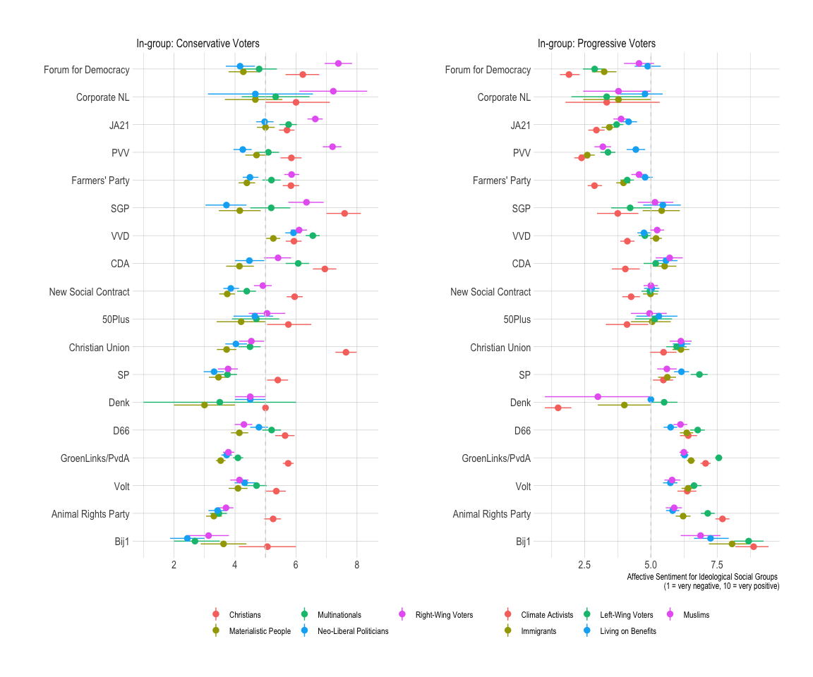

Data Analysis
================

- [Descriptives](#descriptives)
- [Experiment](#experiment)
  - [H1a: Nostalgic messages will increase affective sentiment for
    ideological social
    in-groups.](#h1a-nostalgic-messages-will-increase-affective-sentiment-for-ideological-social-in-groups)
  - [H1b: Messages mentioning scapegoats will increase affective
    sentiment for ideological social
    in-groups.](#h1b-messages-mentioning-scapegoats-will-increase-affective-sentiment-for-ideological-social-in-groups)
  - [H2a: Nostalgic messages will decrease affective sentiment for
    ideological social
    out-groups.](#h2a-nostalgic-messages-will-decrease-affective-sentiment-for-ideological-social-out-groups)
  - [H2b: Messages mentioning scapegoats will decrease affective
    sentiment for ideological social
    out-groups.](#h2b-messages-mentioning-scapegoats-will-decrease-affective-sentiment-for-ideological-social-out-groups)
  - [For in- and out-groups pooled](#for-in--and-out-groups-pooled)
  - [Robustness1: Main analysis without people positioning themselves in
    the
    center](#robustness1-main-analysis-without-people-positioning-themselves-in-the-center)
  - [Robustness2: For each social group
    (appendix)](#robustness2-for-each-social-group-appendix)
  - [Robustness3: Heterogenous
    treatments](#robustness3-heterogenous-treatments)

## Descriptives

## Experiment

### H1a: Nostalgic messages will increase affective sentiment for ideological social in-groups.

### H1b: Messages mentioning scapegoats will increase affective sentiment for ideological social in-groups.

### H2a: Nostalgic messages will decrease affective sentiment for ideological social out-groups.

### H2b: Messages mentioning scapegoats will decrease affective sentiment for ideological social out-groups.

### For in- and out-groups pooled

### Robustness1: Main analysis without people positioning themselves in the center

### Robustness2: For each social group (appendix)

### Robustness3: Heterogenous treatments

#### Ideology

#### Party Choice

#### Populist vs Non-Populist vote support

#### Low vs High Levels of Education

#### Gender

