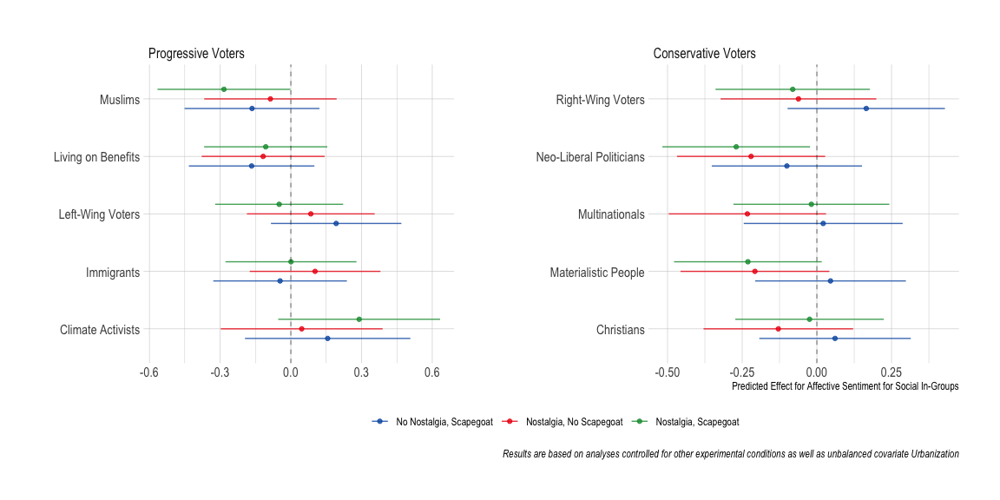

Data Analysis
================

- [Descriptives](#descriptives)
- [Experiment](#experiment)
  - [H1a: Nostalgic messages will increase affective sentiment for
    ideological social
    in-groups.](#h1a-nostalgic-messages-will-increase-affective-sentiment-for-ideological-social-in-groups)
  - [H1b: Messages mentioning scapegoats will increase affective
    sentiment for ideological social
    in-groups.](#h1b-messages-mentioning-scapegoats-will-increase-affective-sentiment-for-ideological-social-in-groups)
  - [H2a: Nostalgic messages will decrease affective sentiment for
    ideological social
    out-groups.](#h2a-nostalgic-messages-will-decrease-affective-sentiment-for-ideological-social-out-groups)
  - [H2b: Messages mentioning scapegoats will decrease affective
    sentiment for ideological social
    out-groups.](#h2b-messages-mentioning-scapegoats-will-decrease-affective-sentiment-for-ideological-social-out-groups)
- [Heterogenous treatments](#heterogenous-treatments)
  - [Ideology](#ideology)
  - [Party Choice](#party-choice)

## Descriptives

## Experiment

### H1a: Nostalgic messages will increase affective sentiment for ideological social in-groups.

### H1b: Messages mentioning scapegoats will increase affective sentiment for ideological social in-groups.

### H2a: Nostalgic messages will decrease affective sentiment for ideological social out-groups.

### H2b: Messages mentioning scapegoats will decrease affective sentiment for ideological social out-groups.

## Heterogenous treatments

### Ideology

### Party Choice

